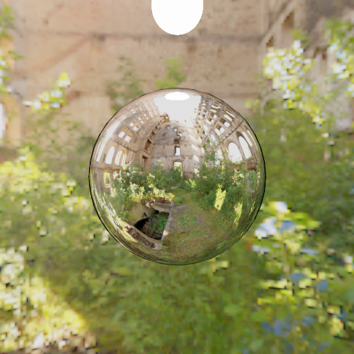
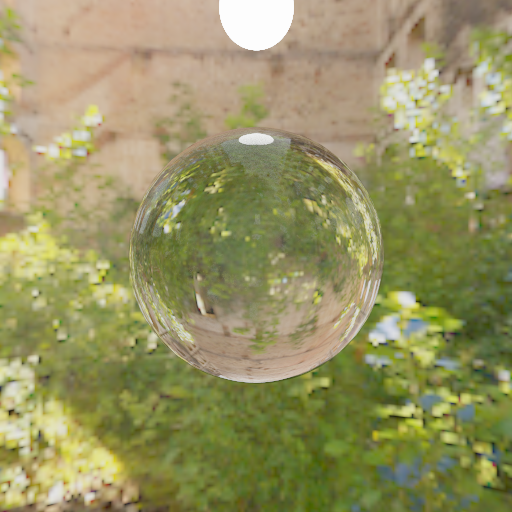
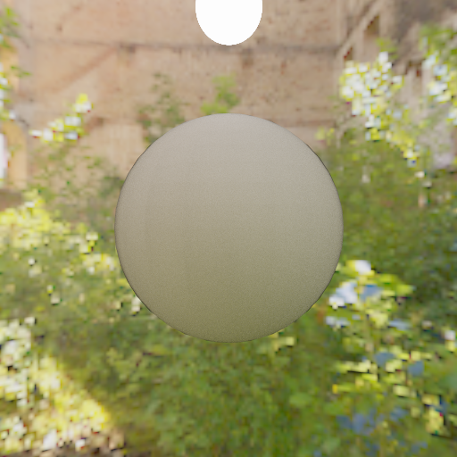

# ti-raytrace

- The code use [Taichi](https://github.com/taichi-dev/taichi) programming language

## Current implement acceleration
- lvbh
- [disney brdf](https://github.com/wdas/brdf)

---

## How to run 
* First config your anaconda workspace, and open the anaconda prompt
* Second you need install [taichi](https://github.com/taichi-dev/taichi) language, **pip install taichi**
* Last you type **ti Render.py**, that's all

---

## Some image produced by this project

- metal

- glass

- non metal

---

## Performance

- 100000 triangle mesh get 30fps with 2070super

###  Other algorithm:

- radix sort

- morton 3d code generation

- compact & downweep

---
# Referrence

- Nvidia 2012: Maximizing Parallelism in the Construction of BVHs,Octrees, and k-d Trees

- Lauterbach 2009:Fast BVH Construction on GPUs