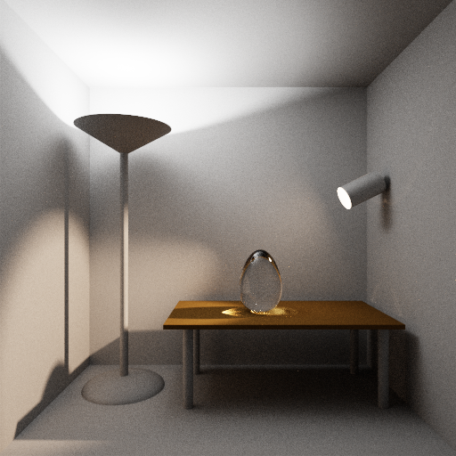
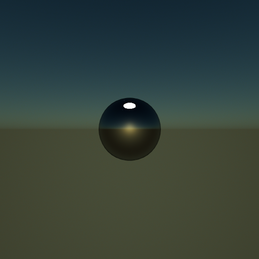
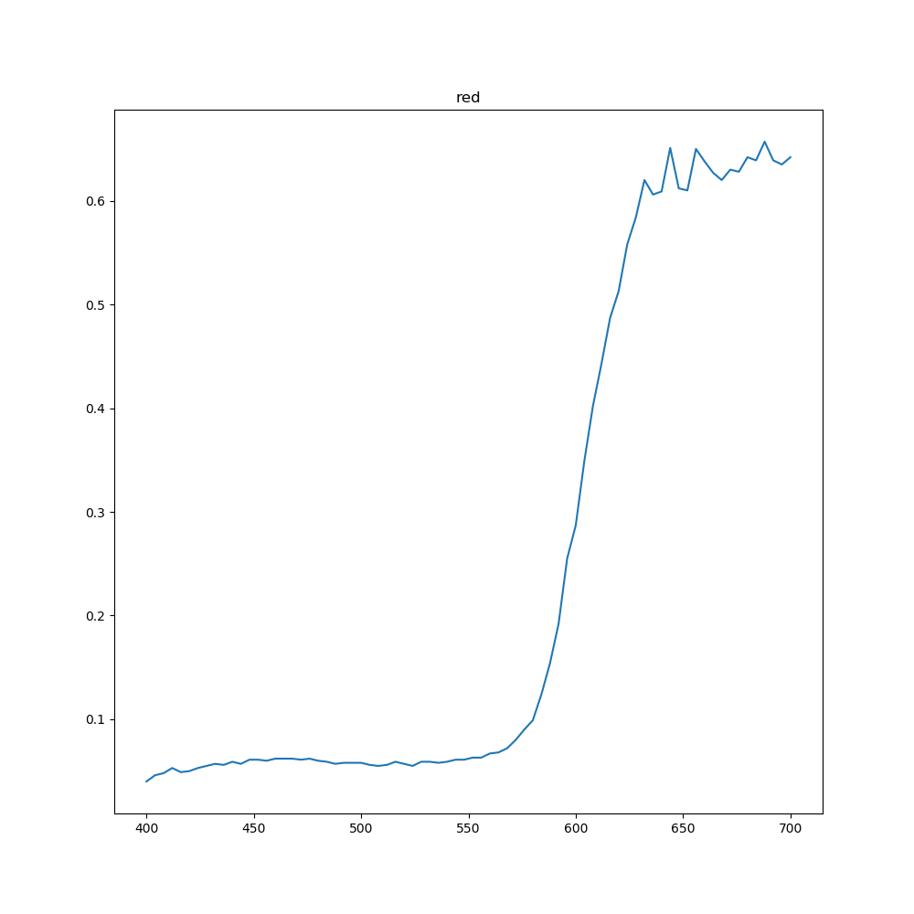
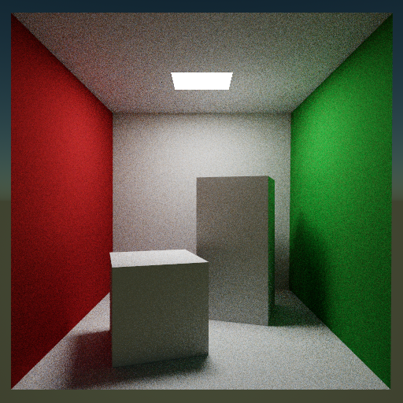
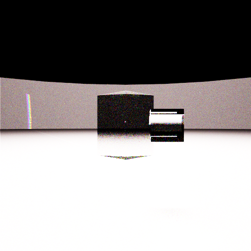

# ti-raytrace

- The project is powered by [Taichi](https://github.com/taichi-dev/taichi) programming language

## core tech overview
- [lvbh](https://developer.nvidia.com/blog/thinking-parallel-part-iii-tree-construction-gpu/)
- [disney brdf](https://github.com/wdas/brdf)
- [bdpt](https://pbr-book.org/3ed-2018/Light_Transport_III_Bidirectional_Methods/Bidirectional_Path_Tracing)
- [spectral rendering](https://github.com/imallett/simple-spectral)
- [rgb upsample spectral](https://github.com/mitsuba-renderer/rgb2spec)
- [sky light](https://cgg.mff.cuni.cz/projects/SkylightModelling/)
---

## How to run 
* First config your anaconda workspace, and open the anaconda prompt
  
* Second you need install dependency  
  ```python
  pip install -r requirements.txt
  ```

* Last you type 
  ```python
  ti Main.py
  ```

---

## Some image produced by this project

### Bidirectional Path Tracing



### sky light simulation



### spectral render

- The red color is produced by spd below



- produce a d65 cornell box



- [using a luxocre example file](https://github.com/LuxCoreRender/LuxCoreTestScenes/releases/download/v2.3/RainbowColorsAndPrism.zip)
- procude prism rainbow

 

---

## Performance

- 100000 triangle mesh get 30fps with 2070super


###  Other algorithm:

- radix sort

- morton 3d code generation

- compact & downweep

---
# Reference

- Nvidia 2012: Maximizing Parallelism in the Construction of BVHs,Octrees, and k-d Trees

- Lauterbach 2009:Fast BVH Construction on GPUs

- An Analytic Model for Full Spectral Sky-Dome Radiance. ACM TOG 31(4)

- Hero wavelength spectral sampling.Eurographics Symposium on Rendering.2014

- A Low-Dimensional Function Space for Efficient Spectral Upsampling.2019

- Towards Bidirectional Path Tracing at Pixar.2016
